# Dessin de caractère à partir des scans des glyphes :

## Extraction

### depuis des fichiers HOCR
Les images des glyphes sont extraits avec le script `/Toolbox/extract-images-from-HOCR.py` :
<pre>
<code>python3.5 Toolbox/extract-images-from-HOCR.py [-c CONFIGFILE] [-H HOCR [HOCR ...]][-i IMAGE [IMAGE ...]] [-m MARGIN] [-o OUTPUT]</code>
# exemple :
<code>python3.5 Toolbox/extract-images-from-HOCR.py -H Layout/hocr-charboxes/ -i Pages/ -o Glyphes/auto-extracted/ -m 2</code></pre>

elles sont enregistrées sous la forme :
`glyph-confiance-page-id_mot-numéro.png`

* `glyph` : caractère ou nom du glyphe
* `confiance` : score de confiance du logiciel OCR en %
* `page` : numéro de la page
* `id_mot` : attribut "id" du mot (parent direct) du glyphe dans le fichier HOCR (`#word_1_numéroDuMot`)
* `numéro` : numéro du glyph dans la page

exemple : `a-85-339-word_1_230-4591.png`
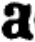

Les glyphes extraits sont directement placés dans des dossiers portant leur nom, pour gagner du temps sur l’étape de tri.

## Tri

Le script `/Toolbox/sort-image-of-char.py`
<pre>
<code>python3.5 Toolbox/sort-image-of-char.py [-c CONFIGFILE] [-r ROOTFOLDER] [-o OUTPUT] [-n] [--hocrI HOCRI] [--hocrO HOCRO]</code>
# exemple :
<code>python3.5 Toolbox/sort-image-of-char.py -r Glyphes/auto-extracted/ --hocrI Layout/hocr-originaux --hocrO Layout/hocr-modifié</code>
</pre>
le script va :

* trier les images à la racine, celles qui ne sont pas triées. Il identifie le caractère de l’image par le premier élément de son titre. Il crée un dossier pour ce caractère si il n’existe pas encore. Il déplace l’image dans le dossier correspondant.

* retrier les images en parcourant les fichiers de tri pour repérer les images dont le nom ne correspond pas au fichier dans lequel elle est. Renommer ces images pour qu’elles correspondent au dossier dans lequel elles sont.

* modifier le nom du glyphe dans le fichier HOCR pour sauvegarder le tri

Il faut vérifier à la main si une image ne correspond pas au dossier où elle est, la déplacer dans le fichier où elle devrait être ou la supprimer. Lancer le script pour mettre à jour leur nom et le fichier HOCR. Il faut aussi séparer les glyphes d’un autre style de caractère (italique, gras...).

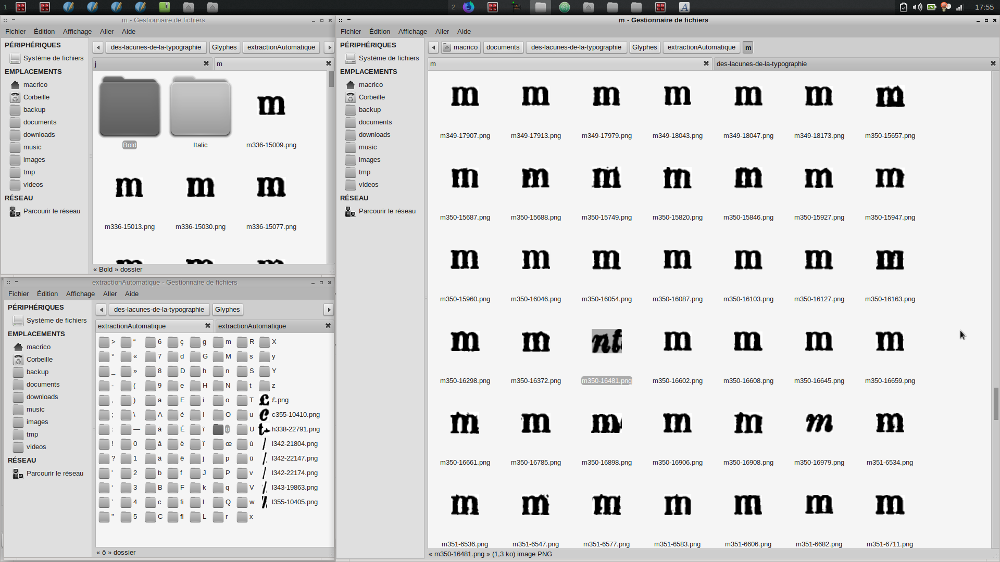

*préciser un fichier `hocrO` pour ne pas sauvegarder dans le fichier originel*

*TODO : vérifier que ces sous-dossiers de style de caractère ne pose pas de problème au script*

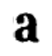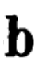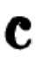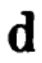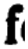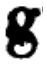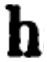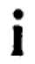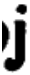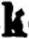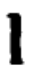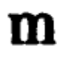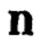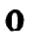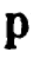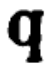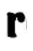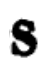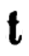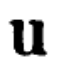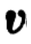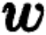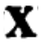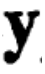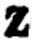

*mieux automatiser la création des gifs et générer un fichier markdown avec tous les noms des gif crées pour rapidement vérifier les tris*

### Ouvrir dans la visionneuse
Pour accélérer le tri, on peut vérifier sur l’image de la page, quelle caractère a été réellement scanné. Pour celà on peut mettre en place un raccourci pour ouvrir le `WebViewer` à la bonne page et centrer la vue sur la glyphe en question.
Un script ouvre un navigateur web à l’adresse où la visionneuse est lancée avec comme arguments la page et l’id du mot parent du glyphe.
```
python3.5 Toolbox/show_in_viewer.py [page-id_mot]
```
Par exemple : `python3.5 Toolbox/show_in_viewer.py 343-word_1_203` ouvrira Firefox sur `localhost:8000/Toolbox/WebViewer/#343-word_1_203`, ainsi la bonne page sera chargée et le focus se fera sur le bon nœud du document HTML.
Pour rendre accessible cette manipulation depuis un navigateur de fichier, sur GNU/linux, on rend le script exécutable `chmod +x Toolbox/show_in_viewer.py`, puis on configure son gestionnaire de fichier pour pouvoir accéder au script depuis le menu `ouvrir avec...` pour que tous les .png puisse être ouvert avec notre programme.

*`click droit` sur l’image du glyphe, `ouvrir avec...` -> `showinviewer.py`*
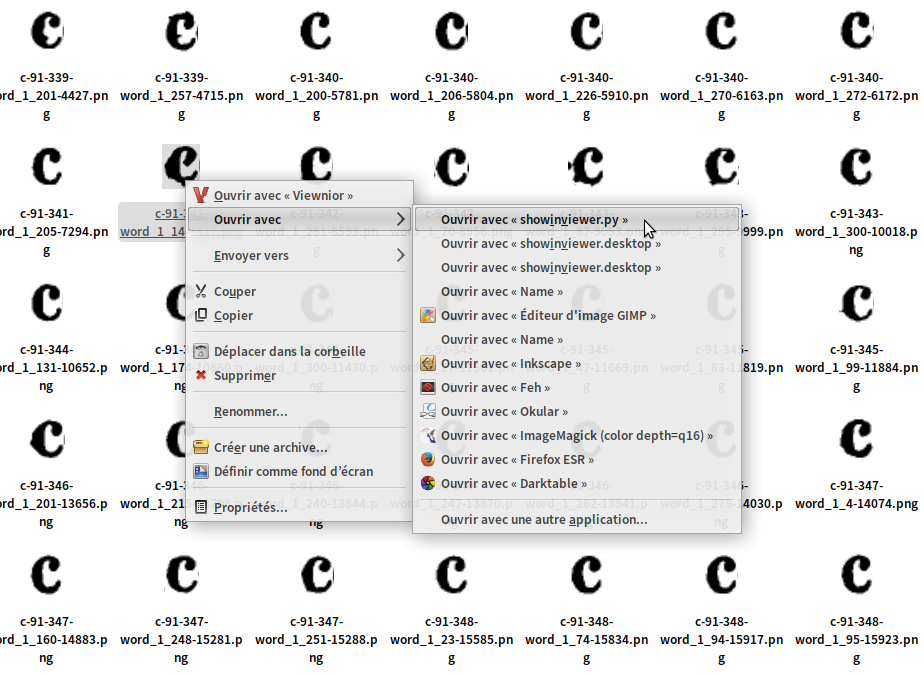

*/!\ cette fonction lancera toujours le WebViewer du projet qui a été configuré. Si plusieurs projets sont en cours ou que le dossier du projet à été déplacé, il faudra éditer le script pour bien configurer les chemins à la main.*

## Moyenne

Créer un caractère qui soit représentatif de l’ensemble des glyphes de l’extrait pour gommer et intégrer les erreurs d’impression. Faire la "moyenne" de tous les glyphes, c’est-à-dire superposer toutes les images du caractère en réduisant leurs opacités. On utilise pour cela la fonction `convert` de  [ImageMagick](https://www.imagemagick.org/script/index.php)
```bash
convert [images...] -average average.png
```
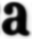
Automatisé dans le script : `Toolbox/average.py`

<pre>
<code>python3.5 average.py [-c CONFIGFILE] [-t TARGETFOLDER [TARGETFOLDER ...]] [-o OUTPUT]</code>
# exemple :
<code>python3.5 Toolbox/average.py -t Glyphes/extractionAutomatique-sorted/a/ Glyphes/extractionAutomatique-sorted/b/ Glyphes/extractionAutomatique-sorted/c -o Glyphes/average/</code>
</pre>

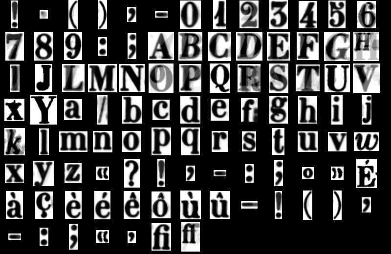

## Contraste de l’image et graisse du glyphe

A partir de cette image moyenne, avant de la vectoriser, il faut augmenter ses contrastes.
Les contours flous de cette forme permettent déjà de choisir la graisse  des glyphes. Pour illustrer l’opération, avec [gimp](gimp), on augmente la résolution de l’image puis on utilise l’outil **Niveaux**.

*avant:*

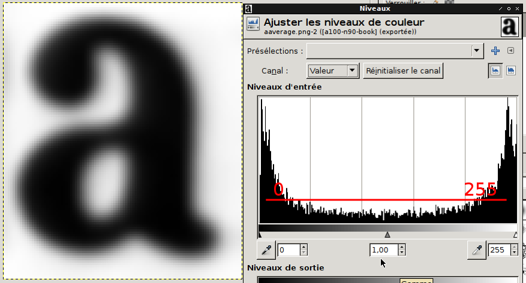

*après:*

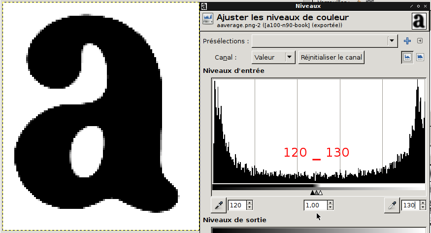

`120 + 130 / 2 = 125` <-- numéro du niveau


[Un point sur les épaisseurs de typographie](http://bigelowandholmes.typepad.com/bigelow-holmes/2015/07/on-font-weight.html)

*la préparation des bitmap peut-être réalisée aussi avec [mkbitmap](http://potrace.sourceforge.net/mkbitmap.html)*

ou alors avec [ImageMagick](https://www.imagemagick.org/Usage/color_mods/#level) :
<pre>
<code>convert {imgSource} -level {mini},{max} {imgOutput}</code>
<code>convert Glyphs/clean/a100.png -level 45%,55% Glyphs/clean/a100-50pc.png #45% + 55% / 2 = 50pc</code> <-- pourcentage du niveau.
</pre>

avec le script `Toolbox/level.py`
<pre>
<code>python3.5 Toolbox/level.py [-c CONFIGFILE] [-m METRICS] [-t TARGET [TARGET ...]] [-o OUTPUT] [-l LEVEL [LEVEL ...]] [-d DELTA]</code>
# exemple :
<code>python3.5 Toolbox/level.py -t Glyphs/average/ -o Glyphs/levels/ -l 15 30 60</code>
</pre>

* agrandit la taille des images
* génère les différents contrastes

<div class="flex-tier">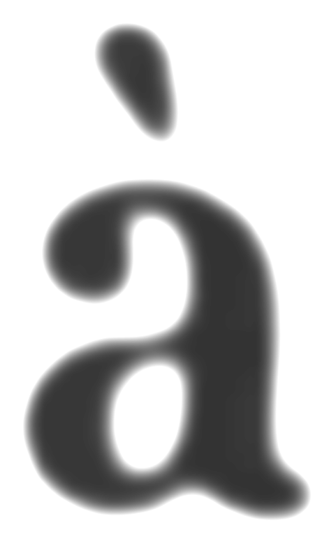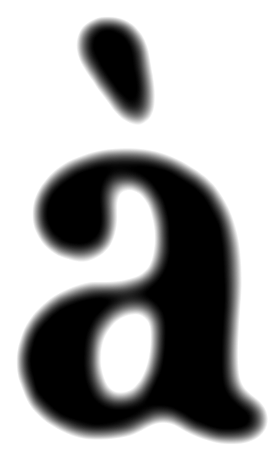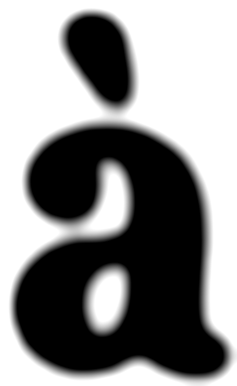</div>
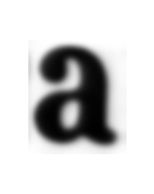

## Vectorisation
avec Inkscape en mode GUI ou ligne de commande, ou directement avec [Potrace](http://potrace.sourceforge.net/) puis retouche et simplification du tracé avec Inkscape.
<pre>
<code>inkscape -f clean/a100.png --select image10 --verb SelectionTrace</code> #ouvre l’interface graphique d’inkscape directement avec l’outil de vectorisation ouvert
<code>potrace clean/a100.bmp -s -o test.svg</code> #vectorisation en ligne de commande (voir man potrace)
</pre>
`potrace clean/a100.bmp -s -o -a test2.svg` `potrace a100.bmp -s --opttolerance 1 -o test4.svg`  `potrace a100.bmp -s --opttolerance 2 -o test5.svg` 

### Qualité du SVG.
Avec Potrace la nœud "path" est enfant d’une balise "g" avec une grosse transformation. Les coordonnées des points du path sont arrondies après la virgules ! Avec inkscape aussi les tracés sont "optimisés" (mélange de coordonnées relatives et absolues). Pour les passer en absolues :

> 'Edit> preferences > SVG Output > Path Data' to always use absolute coordinates (i.e. do not allow relative coordinates). This will only affect newly created paths, or existing objects for which a rewrite of the path data is triggered.
  For existing paths, use 'Edit > Select All in All Layers', and nudge the selection with the arrow keys (e.g. one step up and one back down again). This will trigger a rewrite of the path data in 'd' which will follow the changed preferences for optimized path data. resave.

### Visionner les tracés :
Visionneuse de tracés, points et poignées : *[/Glyphes/vectors/index.html](vectors/index.html)*

*(to do: corriger le décalage entre les handles d’un point à un autre/OK-25-01-17/ mais il reste des problèmes pour les derniers points, après un segClosePath)*

### Simplification :
**pour le moment la simplification des tracés n’est pas implémentée dans un script**

simplification réalisée avec inkscape :


*(to do : faire un script qui simplifie et sauvegarde le tracé une 30ene de fois et qui génère le html pour la visionneuse.)*

### Script `vectorize.py`

<pre>
<code>python3.5 Toolbox/vectorize.py [-c CONFIGFILE] [-t TARGET [TARGET ...]] [-o OUTPUT] [--pnm PNM] [-s SIMPLE] [--html] [-l LEVEL]</code>
# exemple
<code>python3.5 Toolbox/vectorize.py -t Glyphes/levels/a30pc10d.png -o Glyphes/vectors/</code>
</pre>

* convertit en ppm et les enregistre dans Glyphes/clean
* vectorise dans {outputFolder}
* simplifie sous la forme `{char}{level}-simpl{nb simplification}.svg`
* crée un fichier html pour afficher les tracés et leurs poignées
