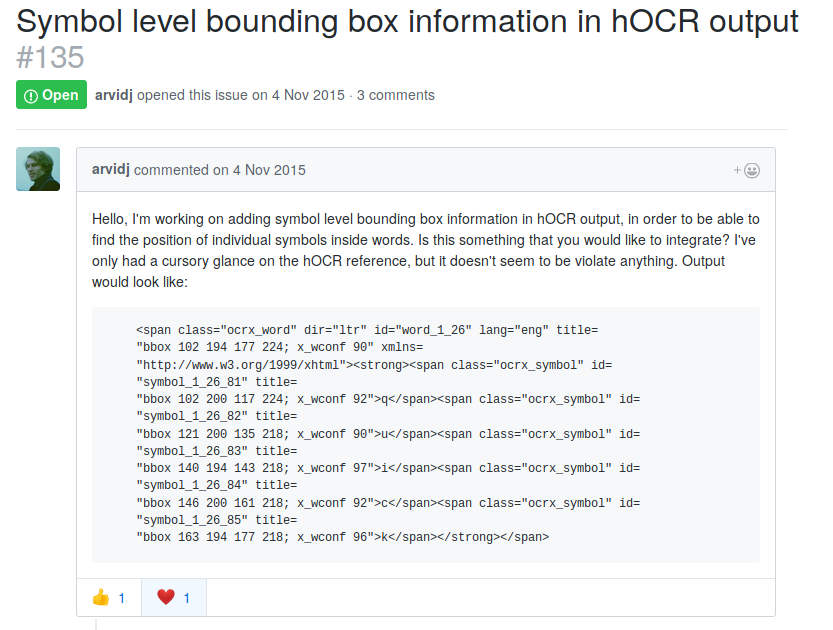
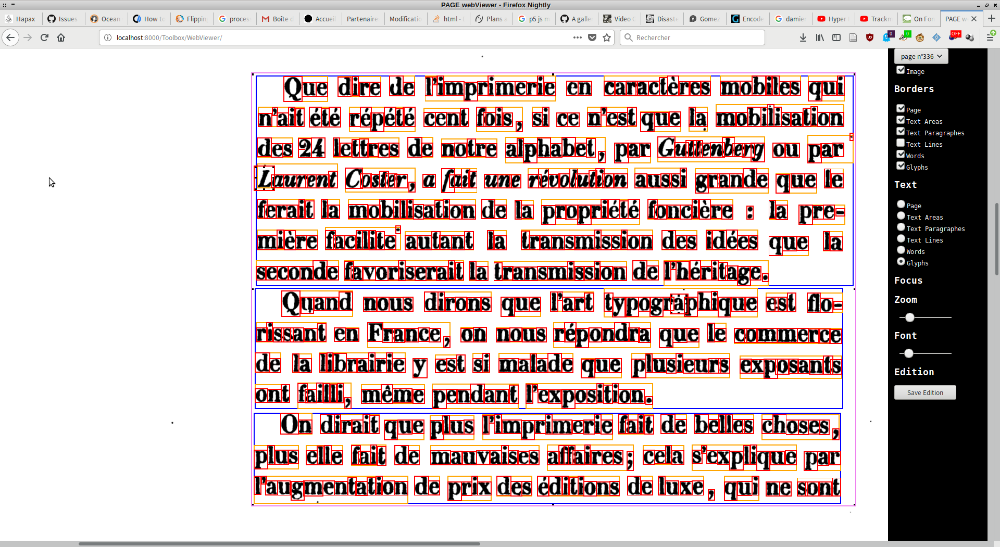

# Analyse de mise en page

### HOCR ou PAGE ?

* [HOCR] est un format de donnée de "OLR" (Optical Layout Recognition) basé sur le html. L’outil en ligne de commande de [Tesseract] avec l’option HOCR ne s’arrêtait qu’au niveau des mots.
* Le labo de recherche [PRImA] a développé son propre format le PAGE basé sue le xml. Ils proposent des outils open-source pour les visualiser et les éditer mais l’outil permettant de générer ces analyses n’est disponible que sur Windows et les sources sont introuvables. Pourtant TPT utilise *Tesseract* et permet de générer un OLR jusqu’au niveau des caractères. (Possibilité de convertir le HORC en PAGE avec [PAGEConverterValidator](http://www.prima.cse.salford.ac.uk/tools/PAGEConverterValidator))

**Mais :**

Pour dessiner les contours des glyphes qui composent le document, nous avons besoin de connaître les coordonnées et les dimensions de chacune d’entre elle. Les documents de OLR doivent donc comprendre toute l’arborescence de la mise en page, jusqu’aux caractères.
<div class="flex-tier">

*voir :* [issue #135](https://github.com/tesseract-ocr/tesseract/issues/135) et la [pull request #310](https://github.com/tesseract-ocr/tesseract/issues/310) du projet *Tesseract*.

<div style="width:100%;"></div>

~~ L’option `hocr_char_boxes` n’est pas disponible dans la version 3.04.01 dispo sur Debian Stretch (ni la branche master 4.00.00alpha). Il faut donc compiler un [fork de la 3.05](https://github.com/nickjwhite/tesseract/tree/hocrcharboxes) `git clone --branch hocrcharboxes https://github.com/nickjwhite/tesseract.git` [avec ce tuto](https://github.com/tesseract-ocr/tesseract/wiki/Compiling-%E2%80%93-GitInstallation). Ne pas oublier [le(s) fichier(s) de langue et d’osd](https://github.com/tesseract-ocr/tesseract/wiki/Data-Files#data-files-for-version-304305) à mettre dans `/usr/local/share/tessdata/` ou spécifier à la main avec l’option `--tessdate-dir` ~~
</div>
```
git clone https://github.com/nickjwhite/tesseract.git --branch hocrcharboxes --single-branch tesseract-hocrcharboxes
```

L’option `hocr_char_boxes` est prise en charge nativement depuis tesseract 4.1 !

<div style="page-break-after: always;"></div>
## Analyse
Analyses de mise en page réalisées sur les fichiers dans */Pages*.

* [Tesseract] -> **HOCR**(html) : zones et mots:
    * code :  `tesseract -l fra [input image] [output file] hocr`
    * */Layout/hocr*

* [Tesseract charboxes] -> **HOCR**(html) : zones, lignes, mots et glyphes :
    * code : `tesseract {image file} -c tessedit_create_hocr=1 -c hocr_char_boxes=1 {output name}`
    * */Layout/hocr-charboxes*

* [PRImA Tesseract OCR to PAGE] (disponible que sur windows)
    * -> **PAGE**(xml) : zones:
        * code :  `...`
        * */Layout/T2P-layout*
    * -> **PAGE**(xml) : zones, lignes, mots et glyphes :
        * code :  `...`
        * */Layout/T2P-layout-glyphs*

[HOCR]:<https://en.wikipedia.org/wiki/HOCR>
[PRImA]:<http://primaresearch.org>
[Tesseract]:<https://github.com/tesseract-ocr/tesseract>
[PRImA Tesseract OCR to PAGE]:<http://www.prima.cse.salford.ac.uk/tools/TesseractOCRToPAGE>

Avec le script : `Toolbox/olr-analyse.py`

<pre>
<code>python3.5 Toolbox/olr-analysis.py [-c CONFIGFILE] [-t TARGET [TARGET ...]] [-o OUTPUT] [-l LANG]</code>
# exemple:
<code>python3.5 Toolbox/olr-analysis.py -t Pages/ -o Layout/hocr-charboxes/ -l fra</code>
</pre>


## hocr-tools
[hocr](https://github.com/tmbdev/hocr-tools#running-the-full-test-suite) est une boite à outil écrite en Python pour valider et corriger les fichiers *.HOCR*

```
hocr-combine Layout/hocr-charboxes/*.hocr > Layout/p336-p356.html
```

ensuite, pour suivre la [specification du format pour la visionneuse](https://github.com/jbaiter/hocrviewer-mirador#data-format) on applique au document le regex suivant :

* rechercher : `id="page_1" title="image &quot;Pages/p(\d+)\.png&quot;; bbox (\d+ \d+ \d+ \d+); ppageno \d+"`

* remplacer :`id="page_$1" title="image ../Pages/p$1.png; bbox $2; ppageno $1"`

Générer un pdf "recherchable" : `hocr-pdf . > hocr.pdf` dans un dossier où il y a un fichier *HOCR* pour un *JPEG* (ex : Layout/hocr-charboxes/)

Il est possible de corriger les fichiers hOCR à partir de fichiers txt ligne par ligne corrigés à la main. (pas encore testé mais cela ne règle pas le problème des césures)

## WebViewer
Visionneuse d’analyses de mise en page (layout) en HTML sur les scans des pages.
```
python3.5 -m http.server 8000
```
ou pour lancer le serveur et configurer l’appli :
```
python3.5 Toolbox/run-web-viewer.py
```
Ouvrir le navigateur et entrer l’url : `localhost:8000/Toolbox/WebViewer`


