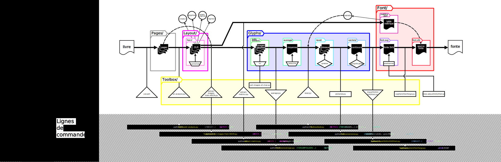
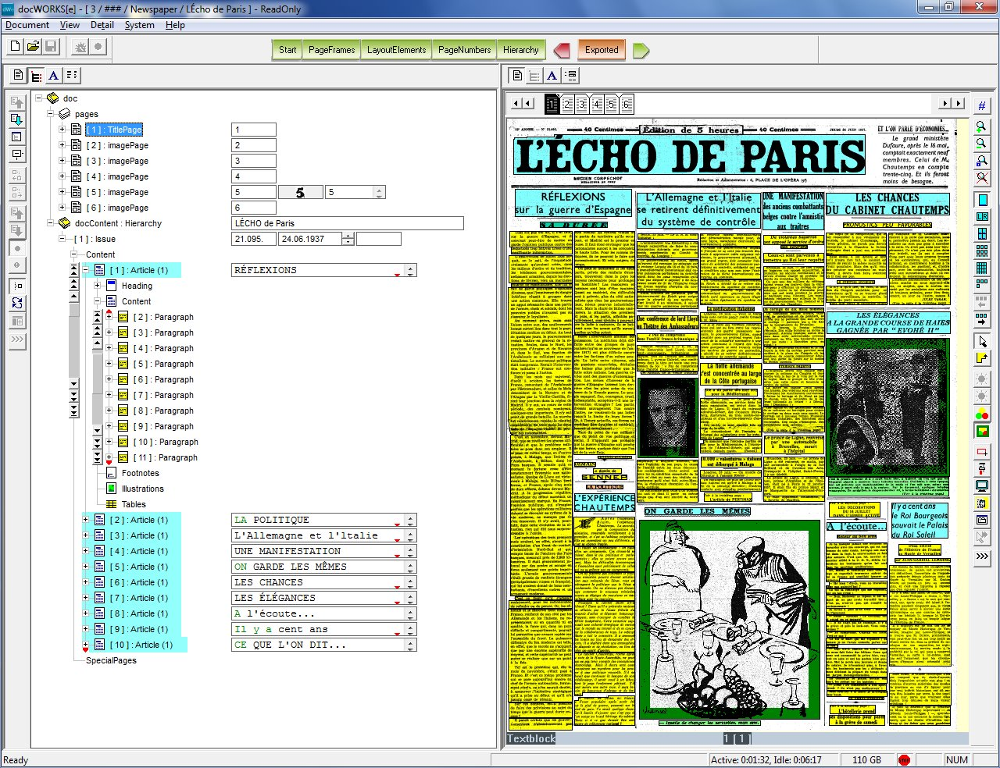

<div id="background" style="display:none"></div>



# Book2Book

est un ensemble d’outils pour produire *une mise en page à partir d’un spécimen*. À partir d’un livre numérisé, l’objectif est d’extraire, de conserver et de réutiliser tous les éléments permettant sa *re-production*.

  * Plusieurs sources de numérisations
  * Extraction des contenus textuels (texte brut) et para-textuels (style, mise en page)
  * Re-fabrication des éléments de mise en page (typographie, métriques, maquette)
  * Génération de fac-similé à partir du texte et de la mise en page extraite

  Le projet consiste en une succession de scripts *Python* qui articule différents outils *libres ou open-sources* en normalisant leurs entrées et leurs sorties dans une architecture de projet claire. La plupart des autres opérations consistent en l’automatisation de manipulations bureautiques (copié, collé, renommer) et de traitement d’image simple (faire une moyenne, un niveau...). Chaque étape est conservée pour permettre de vérifier, corriger ou détourner les différentes formes intermédiaires générées. Un fichier de configuration centralise toutes les variables nécessaires à cette chaîne d’opérations.

## Résumé des étapes de traitement:

1. Récupérer le livre numérisé depuis différentes sources (GoogleBooks ou une numérisation à la main)
2. Décomposer et préparer les pages
3. Extraire le contenu textuel et les informations para-textuelles (mise en page)
4. Extraire chaque image de chaque glyphe de chaque page
5. Récupérer les informations de métriques des fontes
6. Générer le contours moyen de chaque glyphe de chaque fonte
7. Créer les fontes et y importer les contours des glyphes
8. Configurer les métriques et diacritiques des fontes
9. Générer les sources de mise en page des documents reproduis
10. Compiler les sources pour obtenir un document présenté par pages

## Architecture des projets:

<pre class="preblack">
.
├── config.yaml
├── Book                      # livre numérisé en PDF
├── Font                      # éléments relatifs aux fontes du livre
├── Glyphs                    # les images des glyphes        
│   ├── auto-extracted
│   ├── average
│   ├── clean
│   ├── levels
│   ├── specialChar
│   └── vectors
├── Layout                    # informations de mise en page
│   ├── hocr-charboxes
├── Pages                     # images des pages préparées pour le traitement
└── Toolbox                   # intégralité des outils de Book2Book
    ├── BookScanner
    ├── extensionInkscape
    └── WebViewer

</pre>

Ceci est une proposition de nomenclature qui peut être changée dans le fichier de configuration `config.yaml`.

<div style="page-break-before: always; margin-bottom:1cm;"></div>

<div class="margin"></div>

## Testes

D'abord voir `installation.md` pour l'installation des différents outils et de leurs dépendances.
Une procédure de teste très simple permet d'exécuter une première fois l'intégralité de la chaîne de production pour vérifier l'installation des différents outils et générer les illustrations de la documentation.

```
python test.py
```

Une fois le teste passé en intégralité, pour vos documents il est conseillé de réaliser chaque script individuellement et de vérifier et corriger les étapes intermédiaires en mettant à jour les illustrations de la documentation.

## Comment fonctionne cette documentation ?

* Les illustrations de la documentation sont générées au fur à mesure de l'exécution des scripts. Certaines sont des étapes nécessaires aux scripts suivants, d'autres ne servent qu'à illustrer certains principes ou simplifier des étapes de traitements manuels en visualisant des étapes intermédiaires.
* Un diagramme basé sur les graphes de flux présente les outils principaux, leurs dépendances et leurs interactions.`LOOKME.svg`
* Les exemples partent toujours du postulat que l’on se trouve à la racine du projet (`.`) et que l’on utilise la nomenclature par défaut.
* Le détail de l’outil est développé dans des documents séparés `README.md` à la racine des différents dossiers pré-existants (voir Architecture des projets).
* Ces documents décrivent les étapes d’un projet en expliquant le fonctionnement des principaux outils (de leur installation à leur usage dans le cadre de ce projet), ainsi que des commentaires sur les choix techniques, des astuces et des éléments auquel il faut être vigilant.
* *Si une documentation bavarde vous dérange, se référer au diagramme*

Pour la compiler en HTML :

```
pandoc -s -c README.css -f markdown -t html5 README.md BOOK.md LAYOUT.md GLYPHS.md FONT.md -o README.html
```

## Optical Layout Recognition

*OLR* pour *Optical Layout Recognition* est un domaine de recherche du *traitement et analyse d'image*. De la même manière que l'*OCR* à pour mission de reconnaitre et traduire du texte dans des images, l'*OLR* analyse et encode tout les autres éléments de mise en page d'un document à partir d'une image. L'*OLR* est en réalité la première étape d'une reconnaissance de caractère en permettant de décomposer le document en différentes zones d'intéret à traiter (paragraphes, lignes, mots...). En plus de connaitre la position du texte sur le format, on peut en tirer des informations *sémantiques* (les titres, les chapôs, les paragraphes) et *typographiques* (la police, la graisse, l'interlignage...). En regroupant toutes ces strates d'informations :

* textuelles (le contenu)
* sémantique (la structure du document)
* graphique (la mise en page et la caractérisation des éléments graphiques)




<div style="page-break-after: always;"></div>

<div class="margin"></div>

## Imitation typographique

Rendre disponible des dessins typographiques anciens dans des standards numériques actuels est une activité commune dans le monde du design. Excercice de style, hommage, positionement sur un marché spécifique... Ce travail est celui de typographes qui réinterprettent les formes du passsé dans un objectif préçit et   avec un process teinté de subjectivité.

Des recherches scientifiques comme [Re-Typograph](http://re-typograph.loria.fr/)
proposent des processus d'objectivations de la forme pour une plus grande pertinance historique et technique (comme le *squelette générique*). C'est cette recherche de la reproduction parfaite qui les àmène, par exemple, à supprimer les imperfections de l'impression au plomb.


Cette démarche est complémentaire aux deux autres. Le traitement formels est basique et ignore les spécificités technique et historique des spécimens, proposant une arpoche plus photographique que typographique. Toutes les caractéristiques du fac-similé sont intégrées dans la création des nouvelles formes (les défaut d'impression, de conservation, de numérisation), ne cherchant pas à créer un *idéal numérique* d'un document historique mais un outil de *re-production numérique*.

[HOCR]: <https://en.wikipedia.org/wiki/HOCR>
